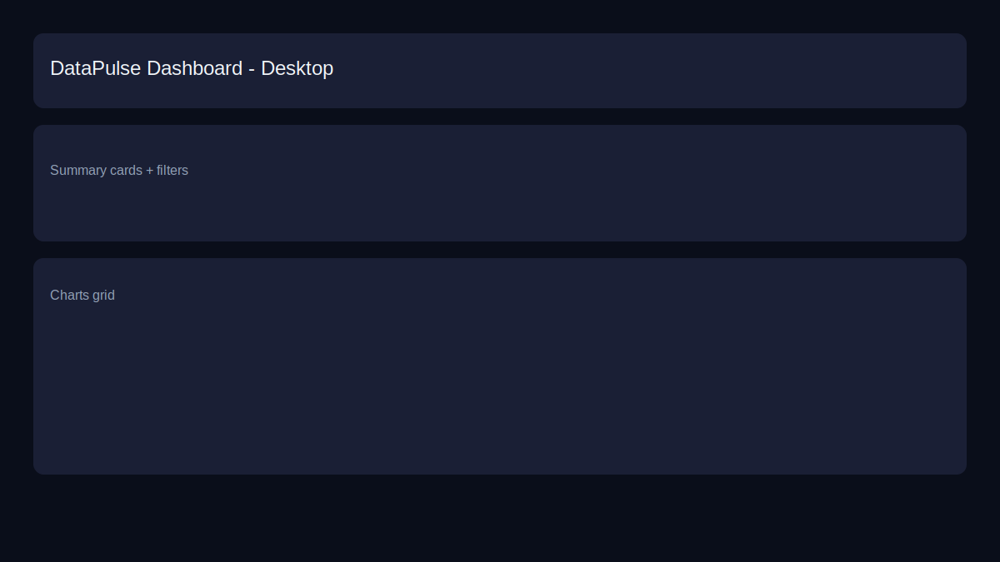
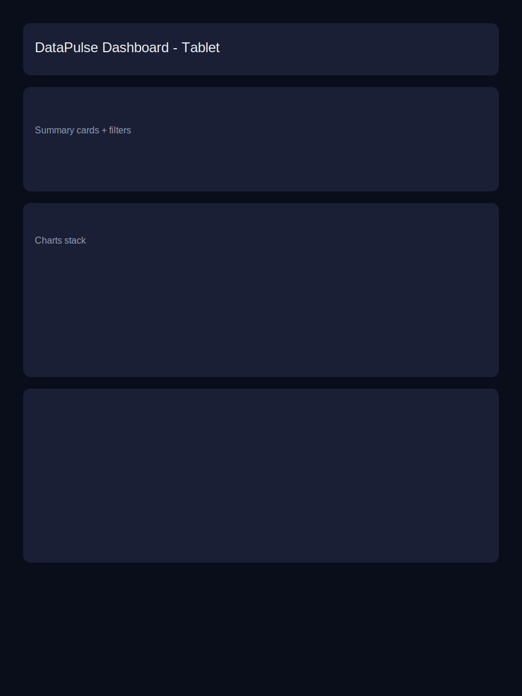
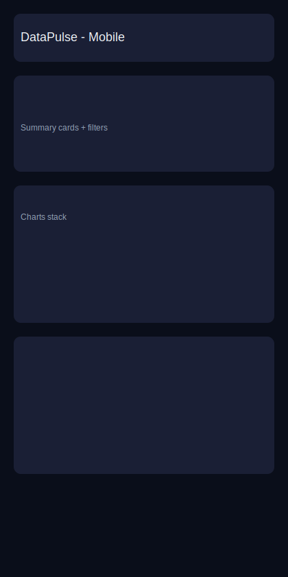

# DataPulse - Interactive Analytics Dashboard

> A responsive, accessible, and interactive data visualization dashboard built with React and Recharts. Explore sales data with dynamic filtering, real-time chart updates, and a premium dark-themed UI.


---

## 📋 Table of Contents

- [Overview](#overview)
- [Key Features](#key-features)
- [Tech Stack](#tech-stack)
- [Getting Started](#getting-started)
- [Running the Application](#running-the-application)
- [Docker Setup](#docker-setup)
- [Project Structure](#project-structure)
- [Data Schema](#data-schema)
- [Architecture & Design Decisions](#architecture--design-decisions)
- [Filtering System](#filtering-system)
- [Responsiveness](#responsiveness)
- [Accessibility](#accessibility)
- [Testing](#testing)
- [Performance Optimizations](#performance-optimizations)
- [Error Handling](#error-handling)
- [Screenshots](#screenshots)

---

## Overview

**DataPulse** is a production-quality interactive data visualization dashboard designed to present complex sales data through intuitive, filterable charts. The dashboard features three distinct chart types (Line, Bar, Pie), four independent filters, and a responsive layout that adapts across mobile, tablet, and desktop viewports.

The application processes a dataset of **120 sales records** spanning all of 2023, across 6 product categories and 4 geographic regions, with revenue, units, and satisfaction metrics.

---

## Key Features

### 📊 Data Visualizations
- **Revenue Trend Line Chart** - Dual-axis time series showing monthly revenue and units sold
- **Category Bar Chart** - Revenue comparison across product categories with color-coded bars
- **Regional Pie Chart** - Donut chart showing revenue distribution by geographic region
- **Data Table** - Sortable table displaying top 15 filtered records

### 🔍 Dynamic Filtering
- **Category Filter** - Dropdown to filter by product category (Electronics, Books, Clothing, Food, Sports, Home)
- **Region Filter** - Dropdown to filter by geographic region (North, South, East, West)
- **Date Range Filter** - Start/end date inputs to narrow the time window
- **Active Filter Tags** - Visual indicators of applied filters with individual remove buttons
- **Reset All** - One-click filter reset button

### 📱 Responsive Design
- Mobile-first approach with three breakpoints
- Charts resize dynamically using Recharts `ResponsiveContainer`
- Grid layout adapts from 1-column (mobile) to 4-column (desktop)

### ♿ Accessibility
- Skip navigation link for keyboard users
- Full keyboard navigation for all interactive elements
- ARIA labels, roles, and live regions throughout
- Screen reader descriptions for chart data
- Focus-visible outlines with proper color contrast
- `prefers-reduced-motion` support

### ⚡ Performance
- `React.memo` on all presentational components
- `useMemo` for expensive data transformations
- `useCallback` for stable handler references
- Code-split vendor chunks (React, Recharts)

---

## Tech Stack

| Technology | Purpose |
|---|---|
| **React 19** | UI framework with hooks for state management |
| **Recharts 3.7** | Composable charting library built on D3 |
| **Vite 7** | Fast build tool with HMR |
| **Vitest** | Unit testing framework |
| **React Testing Library** | Component testing utilities |
| **Docker + Nginx** | Production containerization |
| **Vanilla CSS** | Custom design system with CSS custom properties |

---

## Getting Started

### Prerequisites

- **Node.js** >= 18.x
- **npm** >= 9.x
- **Docker** (optional, for containerized deployment)

### Installation

```bash
# Clone the repository
git clone <repository-url>
cd interactive-dashboard

# Install dependencies
npm install

# Copy environment example (optional)
cp .env.example .env
```

---

## Running the Application

### Development Server

```bash
npm run dev
```

Opens at `http://localhost:5173` with hot module replacement.

### Production Build

```bash
npm run build
npm run preview
```

### Running Tests

```bash
# Run all tests
npm test

# Run tests in watch mode
npm run test:watch

# Run with coverage
npm run test:coverage
```

---

## Docker Setup

### Using Docker Compose (Recommended)

```bash
# Build and start the container
docker-compose up --build

# Run in detached mode
docker-compose up --build -d

# Stop the container
docker-compose down
```

The application will be available at `http://localhost:3000`.

### Using Docker Directly

```bash
# Build the image
docker build -t datapulse-dashboard .

# Run the container
docker run -p 3000:80 datapulse-dashboard
```

---

## Project Structure

```
interactive-dashboard/
├── public/                        # Static assets
├── src/
│   ├── __tests__/                 # Test files
│   │   ├── dataTransformers.test.js   # 42 tests for data utils
│   │   └── components.test.jsx        # 18 tests for components
│   ├── components/
│   │   ├── Dashboard.jsx          # Main container component (state mgmt)
│   │   ├── charts/
│   │   │   ├── LineChart.jsx      # Revenue trend dual-axis line chart
│   │   │   ├── BarChart.jsx       # Category comparison bar chart
│   │   │   └── PieChart.jsx       # Regional distribution donut chart
│   │   ├── filters/
│   │   │   ├── CategoryFilter.jsx # Category dropdown
│   │   │   ├── RegionFilter.jsx   # Region dropdown
│   │   │   └── DateRangeFilter.jsx # Start/end date picker
│   │   └── common/
│   │       ├── LoadingSpinner.jsx  # Accessible loading indicator
│   │       ├── ErrorMessage.jsx   # Error/empty state component
│   │       └── SummaryCards.jsx   # KPI metric cards
│   ├── data/
│   │   └── mockData.json          # 120 data points dataset
│   ├── utils/
│   │   └── dataTransformers.js    # Pure data transformation functions
│   ├── App.jsx                    # Root app shell
│   ├── main.jsx                   # React entry point
│   ├── index.css                  # Complete design system
│   └── setupTests.js              # Test configuration
├── Dockerfile                     # Multi-stage production build
├── docker-compose.yml             # Container orchestration
├── nginx.conf                     # Production server config
├── .env.example                   # Environment variables template
├── .gitignore                     # Git exclusions
├── package.json                   # Dependencies & scripts
├── vite.config.js                 # Build & test configuration
└── README.md                      # This file
```

---

## Data Schema

The mock dataset (`src/data/mockData.json`) contains **120 records** with the following schema:

| Field | Type | Description | Example |
|---|---|---|---|
| `id` | string | Unique identifier | `"1"` |
| `date` | string | ISO date (YYYY-MM-DD) | `"2023-04-15"` |
| `category` | string | Product category | `"Electronics"` |
| `product` | string | Product name | `"Laptop Pro X"` |
| `value` | number | Unit price ($) | `1299` |
| `units` | number | Number of units sold | `15` |
| `region` | string | Geographic region | `"North"` |
| `satisfaction` | number | Customer rating (1-5) | `4.5` |

### Categories
`Electronics`, `Books`, `Clothing`, `Food`, `Sports`, `Home`

### Regions
`North`, `South`, `East`, `West`

---

## Architecture & Design Decisions

### Component Architecture

The dashboard follows a **Container/Presentational** pattern:

```
App (Shell: Header, Footer, Skip Link)
└── Dashboard (Container: State, Effects, Data Flow)
    ├── SummaryCards (Presentational: KPI metrics)
    ├── CategoryFilter (Presentational: Dropdown)
    ├── RegionFilter (Presentational: Dropdown)
    ├── DateRangeFilter (Presentational: Date Inputs)
    ├── RevenueLineChart (Presentational: Recharts Line)
    ├── CategoryBarChart (Presentational: Recharts Bar)
    ├── RegionPieChart (Presentational: Recharts Pie)
    ├── DataTable (Inline: HTML Table)
    ├── LoadingSpinner (Presentational: Loading State)
    └── ErrorMessage (Presentational: Error/Empty State)
```

### State Management

- **`useState`** for filter selections (`category`, `region`, `startDate`, `endDate`), loading state, and error state
- **`useMemo`** for derived/computed data (filtered data, aggregations, summaries)
- **`useCallback`** for stable handler references passed to child components
- **No Redux/Context API** — the component tree is shallow enough that prop passing is clear and maintainable

### Data Flow

```
Raw JSON Data
    ↓ simulateFetch() (simulated API delay)
    ↓ useState: data
    ↓ filterData(data, filters)
    ↓ useMemo: filteredData
    ↓
    ├── aggregateByMonth() → LineChart
    ├── aggregateByCategory() → BarChart
    ├── aggregateByRegion() → PieChart
    └── calculateSummary() → SummaryCards
```

### CSS Architecture

Uses **Vanilla CSS with Custom Properties** (CSS design tokens):
- 80+ CSS custom properties for colors, spacing, typography, shadows, and transitions
- Dark theme with glassmorphism effects
- Responsive breakpoints at 768px, 1024px, and 1440px
- Animations with `prefers-reduced-motion` support
- Print-friendly styles

### Why These Choices?

| Decision | Rationale |
|---|---|
| **React (no Redux)** | Component tree is 2 levels deep — useState + props is simpler and more maintainable |
| **Recharts** | Declarative, composable API that fits React's paradigm; responsive out of the box |
| **Vanilla CSS** | Maximum control over the design system; no build-time overhead; CSS custom properties for theming |
| **Vite** | Much faster than CRA; native ESM dev server; built-in testing with Vitest |
| **Data transformation layer** | Pure functions are independently testable and keep components focused on rendering |

---

## Filtering System

The dashboard supports **4 independent filters** that compose together:

1. **Category** — Select dropdown with "All Categories" default
2. **Region** — Select dropdown with "All Regions" default
3. **Start Date** — Date input with min/max validation
4. **End Date** — Date input with cross-validated min (tied to start date)

### Behavior
- Filters update all charts simultaneously without page reload
- Active filter tags show which filters are applied
- Individual filter removal via tag close buttons
- "Reset Filters" button clears all at once
- Results counter shows `"Showing X of Y records"`
- Empty state shown when no data matches filters

---

## Responsiveness

### Desktop (> 1024px)
- 4-column summary cards grid
- 2-column charts grid (line chart spans full width)
- Inline filter controls

### Tablet (768px - 1024px)
- 2-column summary cards grid
- 1-column charts grid
- Stacked filter controls

### Mobile (< 768px)
- 1-column summary cards grid
- 1-column charts grid
- Full-width stacked filters
- Reduced chart height (250px)
- Compact header

---

## Accessibility

### WCAG 2.1 Compliance
- **Skip Navigation** — Hidden link to jump to main content
- **Semantic HTML** — `header`, `main`, `footer`, `section`, `article`, `table` with proper `scope`
- **ARIA Labels** — All interactive elements have descriptive `aria-label` or `aria-labelledby`
- **ARIA Live Regions** — Filter changes and results count announced via `aria-live="polite"`
- **Role Attributes** — `role="alert"` for errors, `role="status"` for loading/empty states, `role="img"` for charts
- **Chart Descriptions** — Each chart has an `aria-label` describing the data it contains
- **Keyboard Navigation** — All filters, buttons, and links are keyboard navigable
- **Focus Management** — Visible focus outlines with consistent styling
- **Color Contrast** — Text meets WCAG AA contrast ratios
- **Reduced Motion** — Animations disabled when `prefers-reduced-motion: reduce` is set

---

## Testing

### Test Coverage

| File | Tests | Description |
|---|---|---|
| `dataTransformers.test.js` | 42 | Data filtering, aggregation, formatting, edge cases |
| `components.test.jsx` | 18 | Component rendering, accessibility roles, conditional display |
| `charts.test.jsx` | 3 | Chart rendering and keyboard tooltip support |
| **Total** | **63** | |

### Running Tests

```bash
npm test              # Single run
npm run test:watch    # Watch mode
npm run test:coverage # With coverage report
```

### Test Categories
- **Unit tests** for pure data transformation functions
- **Component tests** verifying render output and accessibility
- **Edge case tests** for null/undefined/empty inputs
- **Immutability tests** ensuring input data is not mutated

---

## Performance Optimizations

1. **React.memo** — All presentational components skip re-renders when props haven't changed
2. **useMemo** — Filtered data, aggregations, and computed values are memoized
3. **useCallback** — Filter handlers maintain referential equality across renders
4. **Code Splitting** — Recharts and React are split into separate vendor chunks
5. **Nginx Compression** — Production server serves gzipped assets
6. **Asset Caching** — Static assets cached with `immutable` directives
7. **Lazy rendering** — Only top 15 table rows rendered instead of the full dataset

---

## Error Handling

| Scenario | Behavior |
|---|---|
| **Data fetch failure** | Error alert with retry button |
| **Filter returns empty** | Friendly empty state with reset button |
| **Invalid data** | Graceful fallback to empty arrays |
| **Null/undefined input** | All utility functions handle gracefully |
| **Network simulation** | 1-second loading spinner on initial load |

---

## Screenshots

### Desktop View
The dashboard displays a 4-column KPI summary, a full-width line chart, side-by-side bar and pie charts, and a data table — all with the dark glassmorphism theme.



### Tablet View
KPI cards collapse to 2 columns, charts stack vertically, and filters go full-width.



### Mobile View
Everything stacks to a single column with reduced chart heights and compact spacing.


